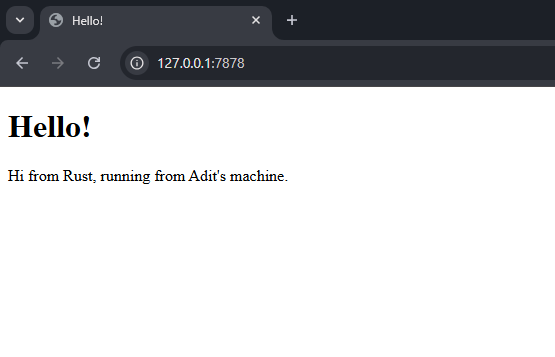
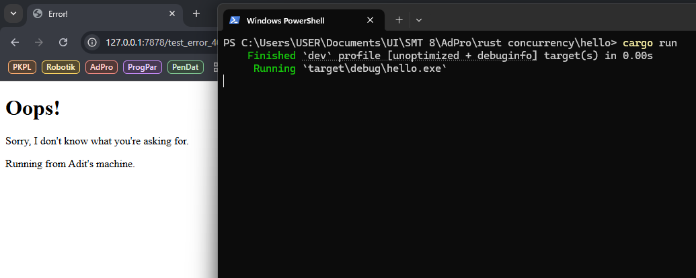

# Commit 1 Reflection

Fungsi handle_connection menerima input "stream" yang merupakan suatu request yang dibuat browser. Lalu isi dari stream dimasukkan ke dalam sebuah buffer terlebih dahulu menggunakan class BufReader. Lalu objek BufReader dilakukan lines() yang mengiterasi baris-barisnya. 

Lalu dilakukan map(|result| result.unwrap()), dimana setiap elemen iterator (yang dianggap "result" pada method call ini) akan di unwrap (yang mengembalikan isi Some dari setiap iterasi). Method take_while(|line| !line.is_empty()) mengembalikan sebuah iterator baru dimana elemen-elemenya diambil dari iterator lama selama elemennya bukan emtpy. Lalu collect() membuat iteratornya menjadi sebuah collection. Pada line terakhir, isi collection diprint ke terminal.

Singkatnya, fungsi handle_connection disini mengeprint seluruh isi dari stream, ie request, yang dibuat browser.

# Commit 2 Reflection



Fungsi handle_connection disini tidak menggunakan variabel buf_reader dan http_request sehingga tidak perlu dijelaskan.

Singkatnya, fungsi handle_connection disini membuat sebuah response secara manual. Sebuah response memiliki format berikut:

```
HTTP-Version Status-Code Reason-Phrase CRLF
headers CRLF
message-body
```

Variabel status_line berisi versi http, kode status response, dan frase status kode. Lalu variabel contents membaca isi hello.html. Dan length merupakan panjang dari isi html yang sudah dibaca. Dan yang terakhir, variabel response merupakan respon yang dibuat secara manual, dimana berisi status respon, panjang isi (yang dimasukkan ke header respon), dan isi dari respon, dengan menggunakan format!().

Line terakhir mengirim kembali respon yang sudah dibuat ke client.

# Commit 3 Reflection



Fungsi handle_connection disini dapat memperlihatkan halaman hello, namun dapat memperlihatkan halaman error apabila diperlukan.

Pertama, fungsi ini diawali dengan line variabel buf_reader dan request_line yang akan membaca request yang datang, lebih spesifiknya baris pertama dari request yang berisi status requestnya. Selanjutnya, apabila requestnya merupakan request GET untuk path "/" maka response yang diberikan akan memiliki status 200 OK dan berisi hello.html. Namun selain request itu, response yang diberikan akan memiliki status 404 NOT FOUND dan berisi 404.html.

Lalu handle_connection diakhiri dengan pembuatan response secara manual, dan dan akan dikirim ke client.

# Commit 4 Reflection

Sekarang handle_connection menangani satu tambahan endpoint, yakni /sleep. Saat masuk ke endpoint tersebut, server akan tidur selama 5 detik sebelum mengirimkan halaman hello.html. Tidur ini mensimulasikan server yang pelan/lemot.

Saat kita masuk ke /sleep lalu langsung membuka /, server akan menangani kedua request di thread yang sama. Dan karena /sleep memerlukan 5 detik, maka / juga perlu menunggu 5 detik tersebut selesai. Akibat server yang single thread ini adalah, apabila ada respon yang pelan, hal ini akan menciptakan sebuah bottleneck dan mempengaruhi request lain.